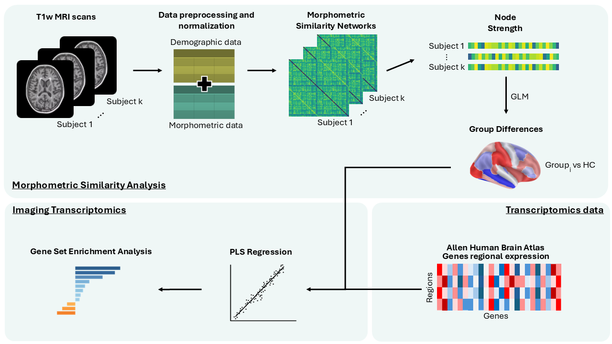

# msnpip — Morphometric Similarity Networks and Transcriptomics Pipeline

[](LICENSE)
[](#status)

> ### 🚧 Under maintenance
> This repository is **actively being reworked** (v2 rebuild in progress). The
> documentation below describes the intended v2 design; some interfaces, outputs,
> and instructions may change or break without notice while maintenance is
> ongoing. Treat it as a preview, not a stable release.

> ### 📌 Thesis snapshot
> The exact version used for the MSc thesis is preserved on branch
> [`v1-april`](https://github.com/tfraa/msntranscript/tree/v1-april)
> (tag `v1.0-thesis`, commit `cc8c776`). `main` is the current, improved v2.

A modular Python pipeline that builds **Morphometric Similarity Networks (MSN)** from
FreeSurfer cortical data, contrasts node strength between groups, and links the regional
patterns to gene expression from the **Allen Human Brain Atlas** via **PLS** and enrichment
(ensemble-GCEA + GSEA). The transcriptomics engine is the
[Imaging Transcriptomics Toolbox](https://github.com/alegiac95/Imaging-transcriptomics)
(v2.0.0), pinned to a fixed commit.



---

## What it does

```
LOAD → VALIDATE → MSN → CONTRAST → (CORRELATION) → (SENSITIVITY) → TRANSCRIPTOMICS → FIGURES → REPORT
```

- **MSN** is a whole-cortex network: within-subject z-scored morphometric features
  (`SurfArea, GrayVol, ThickAvg, MeanCurv, GausCurv`), Pearson similarity, signed-mean node
  strength. Both hemispheres are always used upstream.
- **Group contrast** per region (β / t / Cohen's d), with covariates of your choosing;
  site/scanner are always one-hot encoded.
- **Transcriptomics** runs inside the pinned engine with the **`vasa` surface-spin null**
  (hard-fail if the spin assets are missing — no silent shuffle fallback).
- **No pickle anywhere**: outputs are CSV / Parquet / NPZ / JSON / PNG / PDF only, with a
  sha256 manifest.

---

## Installation

```bash
# Python 3.12 recommended. The engine installs from a pinned git commit, so git is required.
pip install -e .            # add [dev] for the test/lint toolchain: pip install -e ".[dev]"
```

Verify the engine is wired up:

```python
import imaging_transcriptomics as imt
assert any(a.id == "dk" for a in imt.list_atlases())
```

The first run that needs cortical surfaces will fetch the neuromaps fsaverage meshes; in
Docker these are baked at build time (see below).

---

## Quick start

### From FreeSurfer data

```bash
msnpip full \
    --input /path/to/freesurfer_subjects/ \
    --demographics demographics.csv \
    --output out/ \
    --group-col group --case FTD --control HC \
    --predictors age sex tiv \
    --atlas dk --hemisphere left --regions cort \
    --method pls --ncomp 1 --n-perm 10000 \
    --enrichment ensemble gsea
```

### From a pre-merged DataFrame

```bash
msnpip full \
    --dataframe merged.csv \
    --output out/ \
    --group-col group --case FTD --control HC \
    --predictors age sex tiv --exclude-covariate age \
    --correlate-with age --corr-scope global \
    --atlas dk --method pls --ncomp 1 --n-perm 1000 --enrichment ensemble --seed 1234
```

### Python API

```python
from pathlib import Path
from msnpip.config import IOConfig, GLMConfig, EngineConfig, PipelineConfig
from msnpip.pipeline import run_pipeline

cfg = PipelineConfig(
    io=IOConfig(dataframe=Path("merged.csv")),
    output=Path("out/"),
    group_col="group", case="FTD", control="HC",
    glm=GLMConfig(predictors=("age", "sex", "tiv")),
    engine=EngineConfig(methods=("pls", "corr"), n_components=1, n_permutations=10000),
)
run_pipeline(cfg)
```

### Resume / partial runs

```bash
# Run only part of the pipeline:
msnpip full ... --stop-stage MSN
msnpip full ... --start-stage TRANSCRIPTOMICS     # reuses persisted earlier stages

# Resume from a previous run's persisted strength maps:
msnpip from-strength --output out/ --case FTD --control HC --predictors age sex tiv
```

Helpers: `msnpip list-atlases`, `msnpip list-genesets`.

---

## Input data format

### FreeSurfer directory layout

```
freesurfer_subjects/
├── sub-001/stats/{lh,rh}.aparc.stats
├── sub-002/stats/{lh,rh}.aparc.stats
└── ...
```

Extracted metrics: `SurfArea, GrayVol, ThickAvg, MeanCurv, GausCurv` for the Desikan–Killiany
cortical regions (34 per hemisphere).

### Demographics / merged CSV

Roles are auto-detected by **token** matching (so `subject_id` is found, but region columns
like `lh_middletemporal_*` are never mistaken for an id):

| Role | Example column names |
|---|---|
| id | `subject_id`, `participant_id`, `id` |
| group | `group`, `diagnosis`, `dx` |
| age | `age` |
| sex | `sex`, `gender` |
| tiv | `tiv`, `icv` |
| site | `site`, `scanner` |

IDs are matched **exactly after whitespace stripping** — `sub-001` and `sub-1` are distinct.
Feature columns follow `{hemisphere}_{region}_{metric}`, e.g. `lh_superiorfrontal_ThickAvg`.

---

## Output tree

```
out/
  00_inputs/          merged_data.csv  schema.json  resolved_config.yaml  merge_report.json
  01_msn/             strength_maps.csv  global_strength.csv  dropped_subjects.json
                      per_subject_msn/<id>.npz
  02_stats/           contrasts/<case>_vs_<ctrl>_contrast.csv
                      correlation/<variable>__<scope>.csv
                      sensitivity/<case>_vs_<ctrl>__drop_<cov>.csv
  03_transcriptomics/ <case>_vs_<ctrl>/{pls,corr}/   ← engine bundle (TSV/JSON/PNG)
  04_figures/         distributions/  surface/  correlation/
  05_report/          Report.pdf  run_log.txt
  manifest.json       sha256 of every artifact + msnpip/engine versions + seed + resolved config
```

---

## Docker

```bash
docker build -f docker/Dockerfile -t msnpip:2.0 .

docker run --rm -v "$PWD/data:/data:ro" -v "$PWD/out:/out" msnpip:2.0 \
  full --dataframe /data/merged.csv --output /out \
  --group-col group --case FTD --control HC \
  --predictors age sex tiv --atlas dk --method pls --ncomp 1 \
  --n-perm 1000 --enrichment ensemble --seed 1234
```

The image bakes the neuromaps fsaverage cache so cortical plots and the spin null work
offline.

---

## Locked methodological decisions

| Item | Value |
|---|---|
| Null model | `vasa` surface spin only; hard-fail if unavailable |
| MSN | 5 features, within-subject z-score, Pearson, signed-mean strength, both hemispheres |
| Contrast statistic | `beta` (default), `t`, or `cohen_d` |
| Enrichment | `ensemble` primary + `gsea` secondary |
| ID matching | exact after whitespace strip |
| Persistence | no pickle — CSV/Parquet/NPZ/JSON only |
| Site covariate | always one-hot |
| Defaults | atlas `dk`, engine hemisphere `left`, regions `cort`, n-perm 10,000 |

See [docs/statistics.md](docs/statistics.md) and [docs/engine_contract.md](docs/engine_contract.md)
for details, and [docs/adding_an_atlas.md](docs/adding_an_atlas.md) to extend beyond DK.

---

## License

MIT — see [LICENSE](LICENSE).
